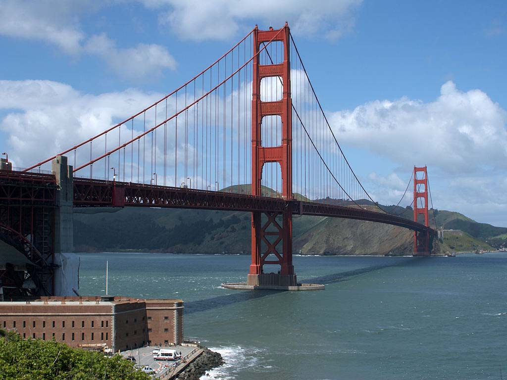

# 🎨 Neural Style Transfer

This project demonstrates Neural Style Transfer using PyTorch. The goal is to apply the artistic style of a painting to the content of another image.

## 📌 How it works

- Load content and style images
- Use VGG19 to extract feature maps
- Calculate content and style losses
- Optimize the target image to combine content and style

## 🔧 Technologies Used

- Python
- PyTorch
- Google Colab
- Matplotlib, PIL

## 📷 Input & Output

| Content Image | Style Image | Stylized Output |
|---------------|-------------|-----------------|
|  |  |  |

## 🧠 Credits

- VGG19 model: torchvision
- NST concept: Gatys et al.

